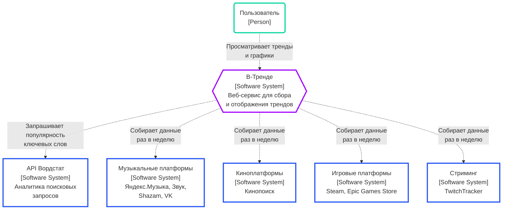
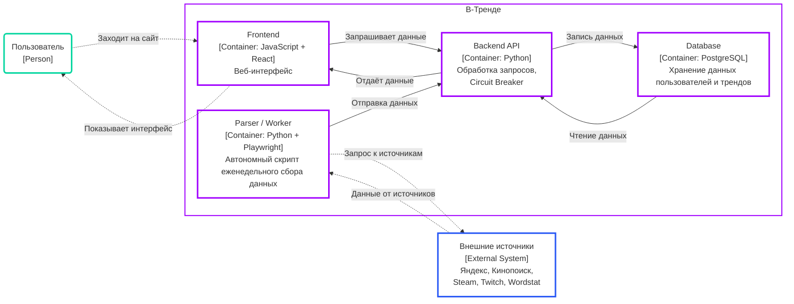
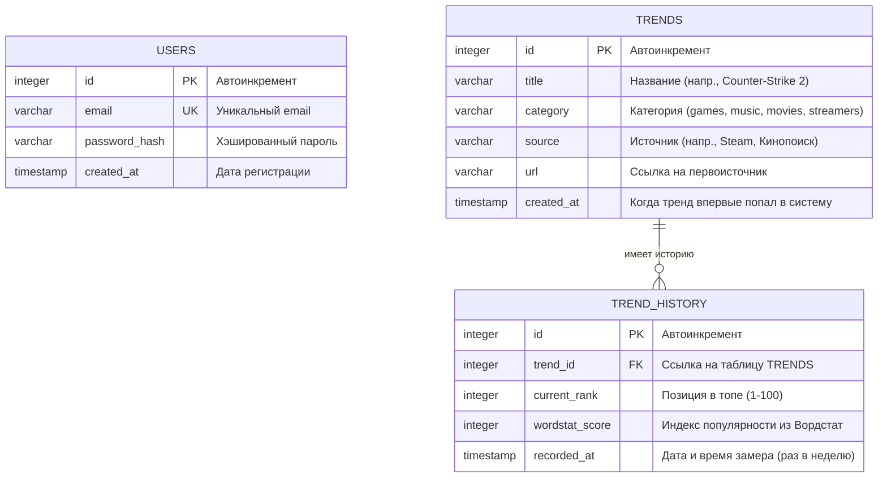
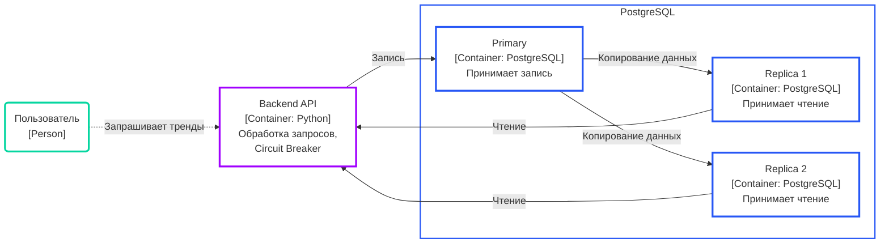

# Веб-сервис для сбора и отображения популярных трендов

## Проблема

Современный человек хочет быть в курсе того, что сейчас популярно, но вынужден собирать эту информацию по десяткам разрозненных сайтов и приложений. На это уходит время, а часть трендов всё равно остаётся незамеченной. В результате пользователь либо тратит часы на поиск, либо пропускает важное.

## Требования

### Пользовательские сценарии

1. Пользователь заходит на главную страницу сайта, на которой располагается единая лента актуальных трендов из различных сфер, прокручивает страницу вниз, чтобы ознакомиться с полным списком, включающим музыку, игры, фильмы и стримеров. В результате пользователь получает список наиболее обсуждаемых событий и может быстро узнать, что сейчас пользуется наибольшей популярностью.

2. Пользователь заходит на главную страницу сайта. Он нажимает на выпадающий список категорий в верхней части страницы и выбирает «Игры». Открывается страница с трендами по категории «Игры».  Затем пользователь нажимает на кнопку «По новизне» в поле фильтров. В результате пользователь получает список актуальных игровых трендов, упорядоченных по времени появления, что позволяет ему быстрее найти подходящие и релевантные инфоповоды.

3. Пользователь регистрируется на сайте, вводя email и пароль. После успешной регистрации открывается главная страница сайта. Пользователь нажимает на карточку тренда и переходит на страницу, с детальным описанием конкретного тренда. Пользователь может видит график изменения его популярности за определенный период. В результате пользователь может оценить, насколько событие сохраняет актуальность, понять растет ли к нему интерес или постепенно угасает.

### Масштаб системы

Оценка нагрузки составляет от 10 000 уникальных пользователей в сутки.

### Отказоустойчивость

Предлагается использовать связку Circuit Breaker + кэширование, так как это наиболее оптимальный вариант для нашей ситуации.

Circuit Breaker позволяет избежать бесконечных повторных запросов к недоступному API. Если API становится недоступным, мы прекращаем попытки обращения после определённого количества неудачных запросов. Далее система периодически проверяет состояние API: если оно восстановилось и работает стабильно — возобновляем нормальную работу. Если нет — продолжаем ждать с заданным интервалом.

Кэширование в этом случае выступает как страховка. При недоступности API мы отдаём последние актуальные данные (например, за предыдущий день). Circuit Breaker параллельно продолжает проверять восстановление соединения. Поскольку тренды у нас обновляются раз в неделю, такой подход не должен создавать критических проблем с актуальностью данных.

Деградации функций в нашем случае избыточна. Оба предложенных механизма уже закрывают основные риски отказоустойчивости. Дополнительное усложнение архитектуры неоправданно. Кроме того, деградация обычно строится на приоритизации функций, а в нашем продукте сложно выделить элементы, которые можно было бы временно отключить без заметного ухудшения пользовательского опыта.

## Разработка архитектуры и детальное проектирование

### Анализ нагрузок

#### Расчет соотношения

Количество уникальных пользователей ≈ 10000

Среднее число сессий на пользователя ≈ 1.3

Среднее число просмотров страниц за сессию ≈ 4

Всего просмотров страниц в сутки = 10000 * 1.3 * 4 = 52000

К Read относится: просмотр главной ленты трендов, просмотр ленты по категории + сортировка, открытие страницы конкретного тренда, запрос истории популярности (график), повторные запросы при обновлении страницы.

Средний Read RPS = 52000 / 86400 = 0.6 запросов в секунду.

Пиковый с коэффициентом 5 = 3 запроса в секунду.

К Write относится: регистрация и авторизация пользователей, обновление текущих трендов и запись истории популярности. Регистрация/авторизация пользователей + еженедельное пакетное обновление трендов парсерами (300 объектов в неделю: 100 треков, 100 игр, 50 фильмов, 50 стримеров). Запись производится батчами раз в 7 дней и создает околонулевую постоянную нагрузку.

Исходя из этого 90–95% Read / 5–10% Write

#### Расчет объемов сетевого трафика

Запросов в сутки ≈ 52000

Средний размер одного ответа ≈ 20 КБ

52000 * 20 КБ = 1040000 ≈ 1.04 ГБ

Возьмем запас для возможных картинок / превью, повторные запросы и рост среднего размера ответа – ориентировочный исходящий трафик ≈ 1.5–2 ГБ в сутки. Требуемая средняя пропускная способность сети: (2 ГБ * 8 бит) / 86 400 сек ≈ 0.185 Мбит/с.

#### Расчет объемов дисковой системы

Размер одной строки записи ≈ 150 байт

300 трендов  *  52 недели  = 18200 записей за год

18200 * 5 = 91000 записей за 5 лет

91000 * 150 ≈ 13.7 мб – общая история за 5 лет

### Архитектурные схемы

#### Context diagram

#### Container diagram

### Контракты API

#### Аутентификация

| № | Метод | Эндпоинт | Описание |  Latency |
|---|-------|----------|----------|---------|
| 1 | POST | `/api/v1/auth/register` | Регистрация нового пользователя | < 500 мс |
| 2 | POST | `/api/v1/auth/login` | Вход в профиль пользователя | < 500 мс |
| 3 | GET | `/api/v1/auth/me` | Получение профиля текущего пользователя | < 100 мс |

#### Тренды

| № | Метод | Эндпоинт | Описание | Параметры | Latency |
|---|-------|----------|----------|-----------|---------|
| 4 | GET | `/api/v1/trends` | Получение трендов для главной страницы | `limit=20, offset=0` | < 30 мс |
| 5 | GET | `/api/v1/trends/category/{category_name}` | Получение трендов по конкретной категории | `sort_by, limit` | < 40 мс |
| 6 | GET | `/api/v1/trends/{trend_id}/history` | Получение временных точек для графика | `period=30d` | < 50 мс |

#### Служебные

| № | Метод | Эндпоинт | Описание | Latency |
|---|-------|----------|----------|---------|
| 7 | POST | `/api/v1/internal/update-trends` | Передача данных парсером в бэкенд | < 100 мс |

### Проектирование данных

## Масштабирование

### Схема масштабирования

Ключевой характеристикой нашей системы является соотношение операций чтения и записи — 95% на 5%. Это означает, что подавляющая часть запросов приходится на чтение. При 100 000 пользователей количество таких запросов достигнет примерно 494 000 в сутки. Одна база данных не сможет эффективно обрабатывать такой объём операций чтения, поэтому мы добавляем реплики PostgreSQL. Главная база (primary) продолжает принимать операции записи, а две реплики (replica1, replica2) принимают на себя операции чтения. Это позволяет распределить нагрузку и сохранить скорость отклика на приемлемом уровне.
